# 📷 Cainta Photography Studio MIS

<div align="center">

**Management Information System for Photography Studios in Cainta, Rizal**


A full-stack web platform connecting customers with photography studios across Cainta, Rizal. Supports bookings, GCash/Maya payments, photo proofing galleries, custom print orders, and a complete studio management suite — with AI chatbot assistance, live payment QR display, and rich analytics.

</div>

---

## Table of Contents

- [System Flow Overview](#system-flow-overview)
- [Booking and Payment Flow](#booking-and-payment-flow)
- [Studio Registration and Approval Flow](#studio-registration-and-approval-flow)
- [Data Flow Diagram](#data-flow-diagram-dfd)
- [Gane-Sarson DFD Levels](#gane-sarson-dfd-levels)
- [Detailed End-to-End Process Flow](#detailed-end-to-end-process-flow)
- [Status Reference](#status-reference)
- [Architecture and Tech Stack](#architecture-and-tech-stack)
- [Database Schema Overview](#database-schema-overview)
- [Getting Started](#getting-started)
- [Account Types and Roles](#account-types-and-roles)
- [Customer Guide](#customer-guide)
- [Studio Owner Guide](#studio-owner-guide)
- [Super Admin Guide](#super-admin-guide)
- [UI and UX Features](#ui-and-ux-features)
- [Notifications and Account Settings](#notifications-and-account-settings)
- [Development Commands](#development-commands)
- [Operational Tips](#operational-tips)

---

## System Flow Overview

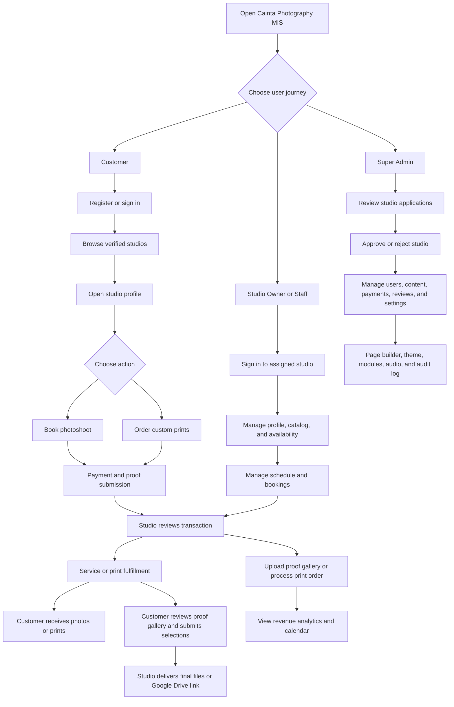

---

## Booking and Payment Flow

```mermaid
flowchart LR
    A[Customer selects studio] --> B[Choose service or package]
    B --> C[Choose date and available time slot]
    C --> D[Select add-ons and review total]
    D --> E{Payment option}
    E --> E1[Downpayment - 30 percent]
    E --> E2[Full Payment]
    E1 --> PM{Payment method}
    E2 --> PM
    PM --> F[GCash — display studio QR or enter reference]
    PM --> G[Maya — display studio QR or enter reference]
    PM --> H[Cash — settle at studio]
    F --> I[Booking and payment recorded]
    G --> I
    H --> I
    I --> J[Studio verifies payment]
    J --> K{Accepted?}
    K -->|Yes| L[Payment: Paid or Verified]
    K -->|No| M[Payment: Rejected — correction required]
    L --> N[Studio confirms booking]
    N --> O[System sends 24h and 2h session reminders]
    O --> P[Customer arrives — photoshoot completed]
    P --> Q[Studio uploads watermarked proof gallery]
    Q --> R[Customer selects photos and adds retouching notes]
    R --> S[Studio delivers final files or Google Drive link]
    S --> T[Customer downloads receipt and submits review]
```

### GCash QR Payment Detail

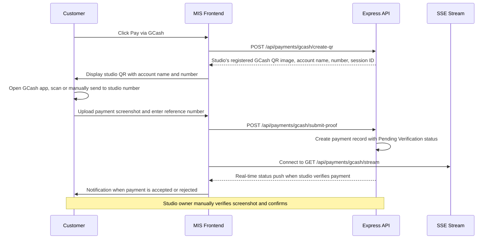

> **Note:** GCash and Maya payments use the studio owner's pre-uploaded static QR code image. There is no third-party payment gateway. The customer scans or sends money to the studio's own GCash/Maya account, then uploads a screenshot proof which the studio verifies manually.

---

## Studio Registration and Approval Flow

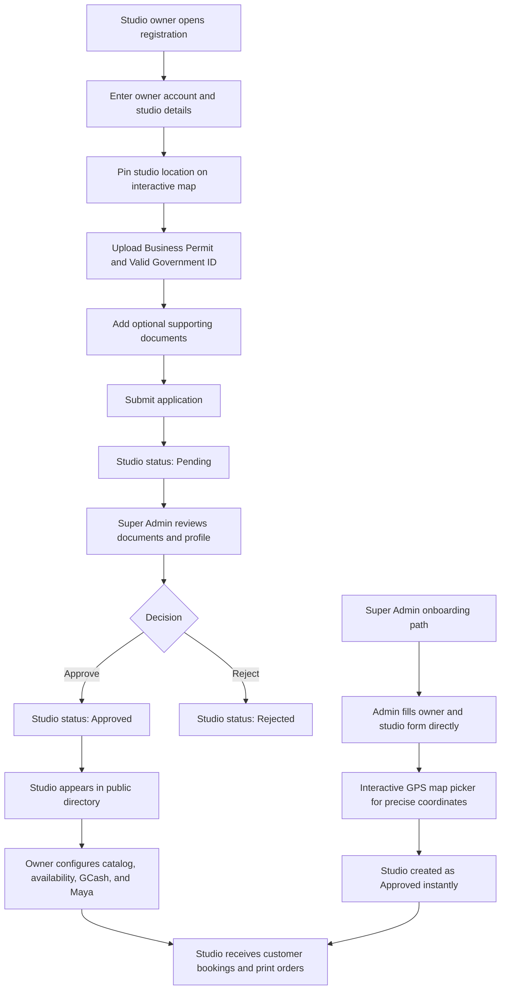

---

## Data Flow Diagram (DFD)

The diagram below shows how information moves between customers, studio teams, Super Admins, application processes, external services, and system data stores.

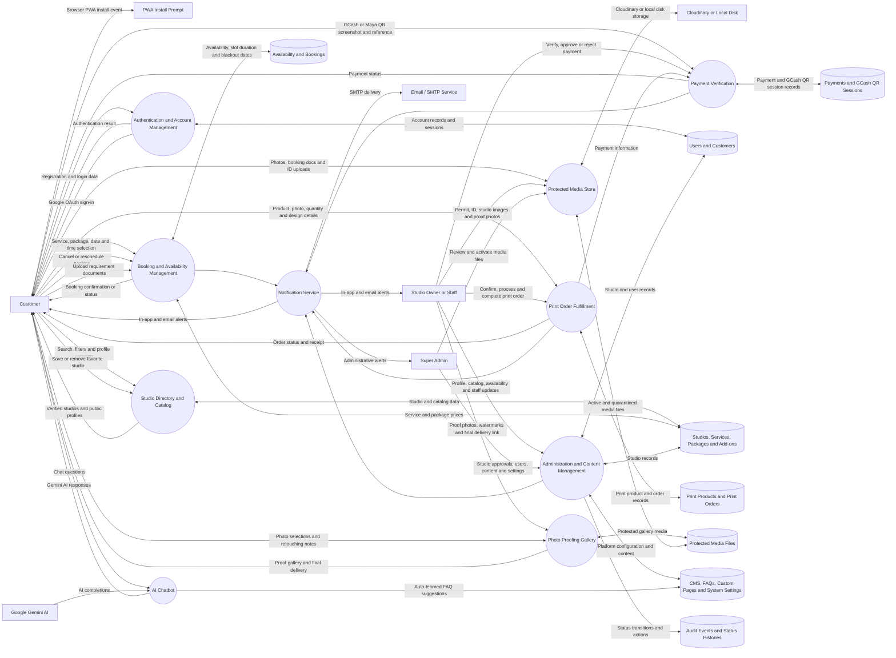

### DFD Data Store Summary

| Data Store | Main Information Saved |
| --- | --- |
| Users and Customers | Login accounts, roles, contact details, Google OAuth credentials, archive status, and in-memory auth sessions |
| Studios and Catalog | Studio profiles, services (with multiple images), packages, add-ons, print products, GPS coordinates, social links, categories, GCash/Maya credentials, and blocked dates |
| Availability and Bookings | Per-day-of-week availability rules, slot duration, blackout dates, booking statuses, reschedule requests, requirement documents, and status history |
| Payments and GCash QR Sessions | Payment amounts, methods (GCash/Maya/Cash), reference numbers, screenshot proofs, QR session state, expiry, fraud scores, and verification status |
| Print Products and Orders | Print catalog, uploaded photos, mockup design settings (frame, backdrop, matte finish, scale), quantities, and fulfillment status |
| Protected Media Files | IDs, permits, payment proofs, proof photos, hero images, and catalog images — each with owner, purpose, checksum, and access status |
| CMS and System Settings | Hero content, About content, FAQs, FAQ suggestions from chatbot, custom pages, theme colors, module toggles, audio settings, demo video, and font/header preferences |
| Audit Events | Immutable log of all administrative actions with actor, entity, before/after values, and IP address |

---

## Gane-Sarson DFD Levels

This section presents the system's data flows using the **Gane-Sarson notation** across all decomposition levels. Each level breaks down the system into progressively finer subprocesses.

> **Notation key (Gane-Sarson)**
> - **Rectangle** — External entity (source or sink of data)
> - **Rounded rectangle / bubble** — Process (numbered by level)
> - **Open-ended rectangle** — Data store
> - **Arrow** — Data flow with label

---

### Level 0 — Context Diagram

Shows the entire system as a single process and its interactions with all external entities.

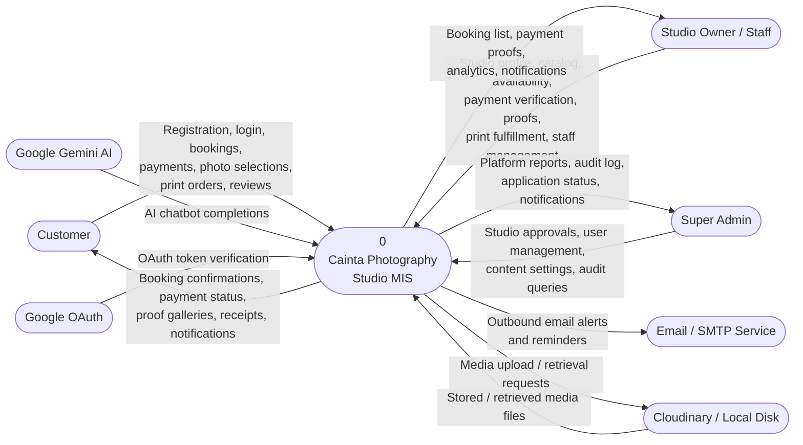

---

### Level 1 — First Decomposition

Breaks the main system into its primary subprocesses.

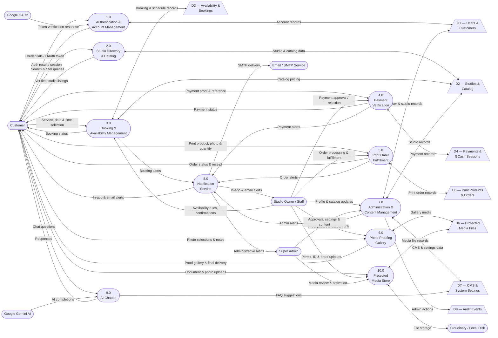

---

### Level 2 — Second Decomposition

Breaks selected Level 1 processes into more detailed subprocesses.

#### 2.1 — Authentication & Account Management (expanded from Process 1.0)

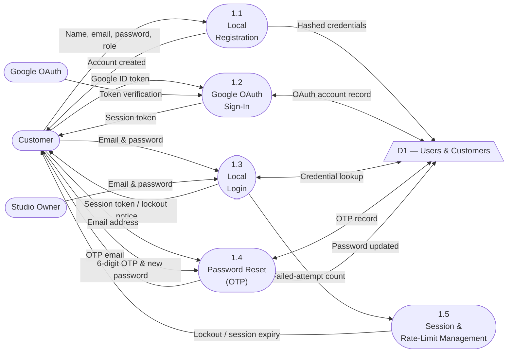

#### 2.2 — Booking & Availability Management (expanded from Process 3.0)

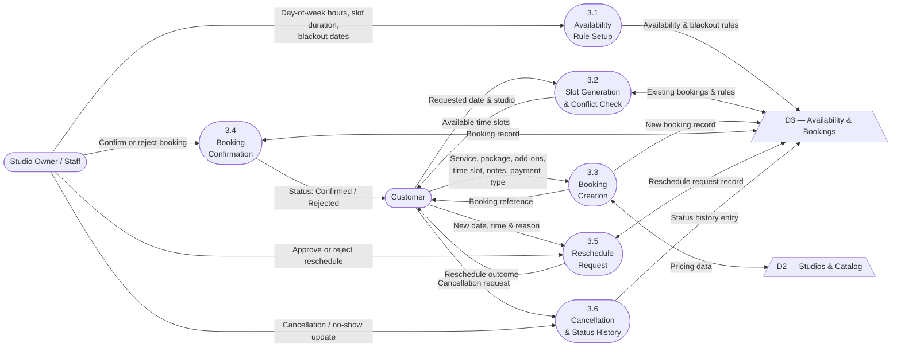

#### 2.3 — Payment Verification (expanded from Process 4.0)

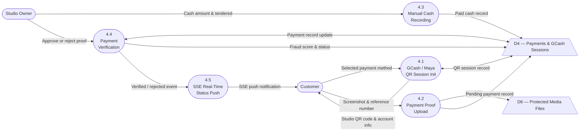

#### 2.4 — Administration & Content Management (expanded from Process 7.0)

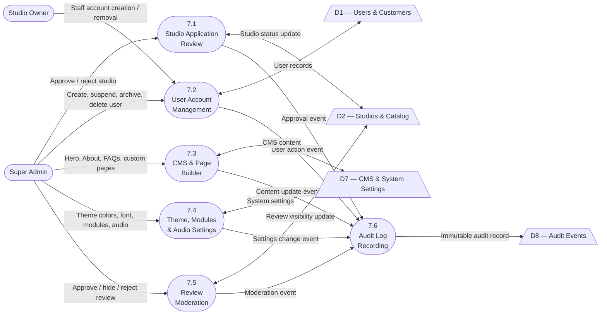

---

### Level 3 — Third Decomposition

Further decomposes the Booking Creation subprocess (Process 3.3) into its granular steps.

#### 3.1 — Booking Creation Detail (expanded from Process 3.3)

```mermaid
flowchart LR
    Customer([Customer])

    DS_Schedules[/"D3 — Availability & Bookings"\]
    DS_Studios[/"D2 — Studios & Catalog"\]
    DS_Payments[/"D4 — Payments & GCash Sessions"\]

    P3_3_1(["3.3.1\nSelect Service,\nPackage & Add-ons"])
    P3_3_2(["3.3.2\nCalculate\nTotal Amount"])
    P3_3_3(["3.3.3\nChoose Payment\nType & Method"])
    P3_3_4(["3.3.4\nConflict &\nDouble-Booking Check"])
    P3_3_5(["3.3.5\nCreate Booking\nRecord"])
    P3_3_6(["3.3.6\nInitiate Payment\nRecord"])
    P3_3_7(["3.3.7\nSend Booking\nConfirmation"])

    Customer -->|"Service ID, package ID, add-on IDs"| P3_3_1
    P3_3_1 <-->|"Catalog items & pricing"| DS_Studios
    P3_3_1 -->|"Selected items & base prices"| P3_3_2

    P3_3_2 -->|"Computed total & downpayment"| P3_3_3
    Customer -->|"Downpayment or full payment,\nGCash / Maya / Cash"| P3_3_3
    P3_3_3 -->|"Payment type & method"| P3_3_4

    P3_3_3 -->|"Requested slot"| P3_3_4
    P3_3_4 <-->|"Existing bookings & blackouts"| DS_Schedules
    P3_3_4 -->|"Slot validated / conflict raised"| P3_3_5

    P3_3_5 -->|"New booking row (Pending)"| DS_Schedules
    P3_3_5 -->|"Booking ID"| P3_3_6

    P3_3_6 -->|"Payment row (Unpaid / Pending Verification)"| DS_Payments
    P3_3_6 -->|"GCash session row (if applicable)"| DS_Payments

    P3_3_5 -->|"Booking reference & status"| P3_3_7
    P3_3_7 -->|"Confirmation details"| Customer
```

---

## Detailed End-to-End Process Flow

### Scenario A: Customer Books a Photoshoot

| Step | Responsible | Action | System Result |
| --- | --- | --- | --- |
| 1 | Customer | Registers a Customer account or signs in (local or Google OAuth). | Account authenticated; session created. |
| 2 | Customer | Opens the Studio Directory and searches by name, location, category, price range, or rating. | Only approved studios are shown. |
| 3 | Customer | Opens a studio profile, reviews services, packages, add-ons, schedule, social links, location, and reviews. | Public catalog and booking action are visible. |
| 4 | Customer | Selects **Book Appointment**. | Booking Wizard opens for the selected studio. |
| 5 | Customer | Selects a service, optional package, add-ons, date, time slot, and booking notes. | System calculates total and checks for overlapping reservations. |
| 6 | Customer | Chooses **Downpayment** (30 percent) or **Full Payment**, then selects a payment method. | System calculates the exact amount due. |
| 7 | Customer | Pays via GCash (scan studio QR or send to studio number, then upload screenshot), Maya (same flow), or confirms a cash booking. | Booking created. Payment record stored as Pending Verification for GCash/Maya, or Unpaid for cash. |
| 8 | System | Creates booking, payment record, GCash QR session (if applicable), customer notification, and audit entry. | Customer receives a booking reference and can track it in their dashboard. |
| 9 | Studio Owner or Staff | Opens **Studio Dashboard → Bookings**, reviews reservation, amount, reference, and proof screenshot. | Pending reservation and payment status are visible. |
| 10 | Studio Owner | Approves or rejects the submitted payment. | Approved becomes **Paid**. Rejected requires a new proof submission. |
| 11 | Studio Owner | Confirms the booking. | Status changes to **Confirmed**. Customer is notified. |
| 12 | System | Sends automated reminder notifications 24 hours and 2 hours before the session. | Customer and studio owner both receive in-app and email reminders. |
| 13 | Customer | Uploads any required document from the booking card (e.g., dress code reference, theme mood board). | Document attached and visible to the studio team. |
| 14 | Customer and Studio Team | Customer arrives; photoshoot is performed. | Studio can mark the booking as Ongoing or Completed. |
| 15 | Studio Owner or Staff | Opens **Proofs**, creates a gallery, uploads watermarked proof photos, configures watermark text and position, and sends the gallery to the customer. | Gallery status: **Sent to Client**. |
| 16 | Customer | Reviews proof photos, stars the photos they want finalized, adds per-photo retouching notes, and submits selections. | Gallery status: **Client Reviewed**. Studio receives selections. |
| 17 | Studio Owner or Staff | Completes editing, uploads final files or adds a Google Drive delivery link, marks gallery **Completed**. | Customer can access final delivery. |
| 18 | Studio Owner | Records remaining balance when applicable; marks booking **Completed**. | Payment totals updated. |
| 19 | Customer | Downloads the booking receipt PDF; syncs the event to Google Calendar or downloads a .ics file; submits a star rating and written review. | Review enters Super Admin moderation before public display. |
| 20 | Studio Owner | Can reply to a customer review with a public response. | Reply is visible on the studio's public profile alongside the review. |
| 21 | Super Admin | Moderates reviews in **Admin Dashboard → Finance → Reviews** when needed. | Approved reviews appear on the studio's public profile. |

### Booking Approval Responsibility

1. The **Customer** creates the booking and submits payment information.
2. The **System** checks the schedule, prevents double-booking, calculates payment amounts, records the transaction, and fires automated reminders.
3. The **Studio Owner** is responsible for approving or rejecting payment proofs and confirming the reservation.
4. **Studio Staff** can assist with booking operations, proofing, and print fulfillment. Owner-only controls (payment verification, staff management) remain restricted.
5. The **Super Admin** does not approve individual bookings. The Super Admin monitors platform-wide payments, moderates reviews, and manages users and studios.

---

### Scenario B: Customer Orders a Print

| Step | Responsible | Action | System Result |
| --- | --- | --- | --- |
| 1 | Studio Owner | Adds a print product with name, size, price, product images, and estimated fulfillment hours. | Product appears in the studio's public Printing Shop. |
| 2 | Customer | Opens the studio profile and selects **Order Custom Prints**. | Print Order Wizard opens for that studio. |
| 3 | Customer | Selects the print product and quantity. | System calculates the print total. |
| 4 | Customer | Uploads the photo to be printed; uses the mockup preview to check frame style (black, oak, gold, or frameless), paper sheen (glossy or matte), backdrop (neutral, cozy, gallery, or easel), and scaling (fit or fill). | Uploaded image is attached to the draft print order. |
| 5 | Customer | Reviews the order summary and confirms payment method (Cash at studio counter). | Print order submitted with **Pending** status. |
| 6 | Studio Owner or Staff | Opens **Studio Dashboard → Prints**, reviews the uploaded photo, product, mockup design, quantity, and payment status. | Team can accept or cancel the order. |
| 7 | Studio Owner or Staff | Records cash payment with optional tendered and change amounts. | Print payment becomes **Paid**. |
| 8 | Studio Owner or Staff | Confirms the order, starts printing, and advances the fulfillment stage. | Order moves through **Confirmed → Processing → Quality Check → Ready for Pickup**. |
| 9 | Customer | Picks up the order at the studio. | Studio marks the order **Completed**. |
| 10 | Customer or Studio Owner | Downloads the print-order receipt PDF for the completed transaction. | PDF receipt generated with order and payment details. |

> **Note:** All print orders are for studio pickup only. There is no shipping or delivery option. Payment is always cash at the studio counter — no online payment is accepted for print orders.

---

### Scenario C: Studio Owner Registration and Publication

| Step | Responsible | Action | System Result |
| --- | --- | --- | --- |
| 1 | Studio Owner | Registers as a Studio Owner and enters owner account and studio details. | Studio-owner account and pending studio record created. |
| 2 | Studio Owner | Pins the studio location on the interactive map and uploads the DTI or Mayor's Business Permit and Valid Government ID. | Compliance documents stored as protected media with quarantine status until reviewed. |
| 3 | System | Sets studio status to **Pending** and notifies the Super Admin. | Studio hidden from the public directory. |
| 4 | Super Admin | Reviews studio profile, location, permit, ID, and supporting documents. | Application ready for decision. |
| 5 | Super Admin | Selects **Approve Studio** or **Reject**. | Studio becomes **Approved** or **Rejected**. |
| 6 | System | Sends result to the studio owner via in-app notification and email (when SMTP is configured). | Approved owners can sign in to the Studio Portal. |
| 7 | Studio Owner | Adds branding, services, packages, add-ons, availability, GCash/Maya QR and account details, social links, staff, and print products. | Public studio profile becomes ready for customers. |
| 8 | Customer | Finds the approved studio in the public directory. | Studio can now receive bookings and print orders. |

---

## Status Reference

### Studio Statuses

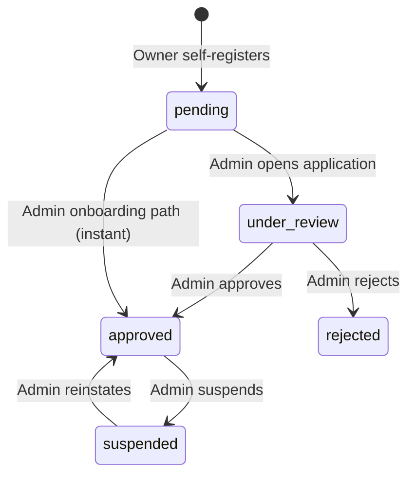

| Status | Meaning |
| --- | --- |
| `pending` | Newly registered; waiting for Super Admin review |
| `under_review` | Application is actively being reviewed |
| `approved` | Published and able to receive bookings |
| `rejected` | Registration was declined |
| `suspended` | Previously approved but publication and access disabled |

---

### Booking Statuses

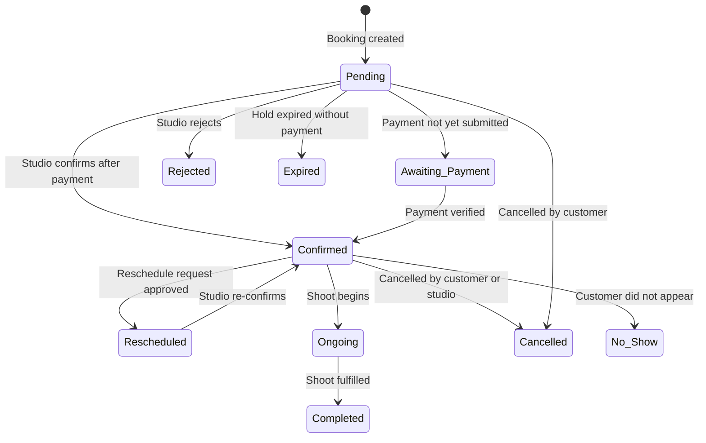

| Status | Meaning |
| --- | --- |
| `Pending` | Booking created; initial state |
| `Awaiting Payment` | Created but payment not yet submitted |
| `Confirmed` | Accepted by the studio after payment verification |
| `Rescheduled` | Date or time changed after initial confirmation |
| `Ongoing` | Photoshoot is currently in progress |
| `Completed` | Photoshoot fulfilled; review becomes available |
| `Cancelled` | Cancelled by customer or studio; stores reason, cancelled-by, and timestamp |
| `Rejected` | Rejected by studio admin |
| `Expired` | Booking hold time window elapsed without payment |
| `No Show` | Customer did not appear for the appointment |

### Reschedule Request Statuses

| Status | Meaning |
| --- | --- |
| `pending` | Customer submitted a reschedule request; awaiting studio review |
| `approved` | Studio approved the new date and time |
| `rejected` | Studio declined the request; original schedule retained |

---

### Payment Statuses

| Status | Meaning |
| --- | --- |
| `Unpaid` | No payment has been recorded |
| `Pending Verification` | Screenshot proof submitted; studio must review |
| `Partially Paid` | Downpayment received; balance outstanding |
| `Paid` | Payment accepted by studio |
| `Refunded` | Payment returned to customer |
| `Failed` | Payment was not accepted or transaction failed |

### Payment Types

| Type | Description |
| --- | --- |
| `Downpayment` | 30 percent of booking total; default option |
| `Balance` | Remaining amount after downpayment |
| `Full Payment` | Complete booking amount in one transaction |
| `PrintOrder` | Payment for a print order |

### Payment Methods and Channels

| Method | Channel | Description |
| --- | --- | --- |
| `GCash` | `gcash_qr` | Customer scans or sends to studio's GCash number, then uploads screenshot proof |
| `GCash` | `manual_upload` | Customer uploads GCash screenshot and enters the reference number manually |
| `Maya` | `manual_upload` | Same flow using Maya (PayMaya) |
| `Cash` | `cash` | In-person cash payment recorded by studio staff |

> **Note:** Bank transfer is not supported. All online payments go directly to the studio's own GCash or Maya account — there is no third-party payment gateway (PayMongo, Xendit, etc.). The studio owner uploads their QR code image and account number in their payment credentials settings.

---

### Print Order Statuses

```mermaid
stateDiagram-v2
    [*] --> Pending : Order placed
    Pending --> Confirmed : Studio accepts order
    Confirmed --> Processing : Printing begins
    Processing --> Quality_Check : Print completed; QA underway
    Quality_Check --> Ready_for_Pickup : Passed QA
    Quality_Check --> Processing : Returned for rework
    Ready_for_Pickup --> Completed : Customer collects
    Pending --> Cancelled : Cancelled by customer or studio
    Confirmed --> Cancelled : Cancelled
    Processing --> Cancelled : Cancelled
    Quality_Check --> Cancelled : Cancelled
```

| Status | Meaning |
| --- | --- |
| `Pending` | Order submitted; awaiting studio confirmation |
| `Confirmed` | Studio accepted the order |
| `Processing` | Printing is in progress |
| `Quality Check` | Print complete; undergoing inspection and framing |
| `Ready for Pickup` | Passed QA; available at the studio counter |
| `Completed` | Order fulfilled; customer collected |
| `Cancelled` | Cancelled by customer or studio |

### Photo Proofing Gallery Statuses

| Status | Meaning |
| --- | --- |
| `draft` | Gallery created by studio; not yet shared with customer |
| `sent_to_client` | Gallery sent to customer for review |
| `client_reviewed` | Customer submitted photo selections and retouching notes |
| `completed` | Studio delivered final files or Google Drive link |

---

## Architecture and Tech Stack

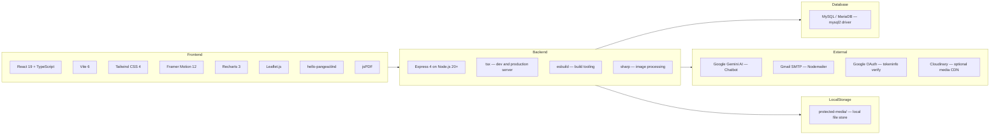

### Dependency Summary

| Category | Package | Version |
| --- | --- | --- |
| UI Framework | React + React DOM | 19.0 |
| Language | TypeScript | ~5.8 |
| Build Tool | Vite | 6 |
| Styling | Tailwind CSS + @tailwindcss/vite | 4 |
| Animation | motion (Framer Motion) | 12 |
| Charts | Recharts | 3 |
| Maps | Leaflet + @types/leaflet | 1.9 |
| Drag & Drop | @hello-pangea/dnd | 18 |
| Icons | Lucide React | 0.546 |
| PDF Generation | jsPDF | 4 |
| HTTP Server | Express | 4 |
| Database Driver | mysql2 | 3 |
| Image Processing | sharp | 0.35 |
| Password Hashing | bcryptjs | 3 |
| Email | Nodemailer | 9 |
| QR Code Rendering | qrcode | 1.5 |
| Environment | dotenv | 17 |
| AI Chatbot | @google/genai | 2 |
| Media CDN (optional) | cloudinary | 2 |
| Dev/Prod Server | tsx | 4 |
| Build Tooling | esbuild | 0.25 |
| Testing | Vitest | 5 |

---

## Database Schema Overview

### Setup

The recommended setup for a local XAMPP environment uses `cainta_photography_mis.sql`, which is a complete phpMyAdmin dump of the database including all tables and seed data.

```bash
# Import via phpMyAdmin (recommended for XAMPP)
# 1. Open http://localhost/phpmyadmin
# 2. Create a database named: cainta_photography_mis
# 3. Import cainta_photography_mis.sql

# Or import via command line
mysql -u root cainta_photography_mis < cainta_photography_mis.sql
```

Alternatively, `database_setup.sql` provides a clean schema-only script for fresh environments.

### Entity Relationship Diagram

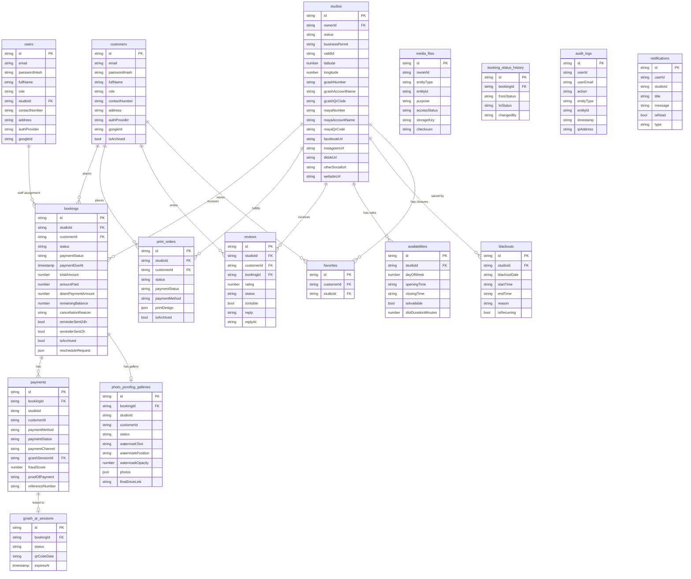

---

## Getting Started

### Requirements

| Requirement | Version |
| --- | --- |
| Node.js | 20 or later |
| MySQL / MariaDB | 10.4 or later (included in XAMPP) |
| XAMPP (recommended) | Any current version |

Optional:
- `GEMINI_API_KEY` — required for the AI photography guide chatbot
- SMTP credentials — required for email notifications
- `GOOGLE_CLIENT_ID` / `VITE_GOOGLE_CLIENT_ID` — required for Google OAuth sign-in
- Cloudinary credentials — optional; falls back to local `protected-media/` storage

### Local Setup

1. Clone or extract the project into `C:\xampp\htdocs\cainta-photography-studio-mis`.

2. Start XAMPP and ensure **Apache** and **MySQL** are running.

3. Open phpMyAdmin (`http://localhost/phpmyadmin`), create a database named `cainta_photography_mis`, then import `cainta_photography_mis.sql`.

4. Open a terminal in the project folder and install dependencies:

   ```bash
   npm install
   ```

5. Create a `.env` file in the project root and configure your variables:

   ```env
   # ── Database ─────────────────────────────────────────
   DB_HOST=localhost
   DB_PORT=3306
   DB_USER=root
   DB_PASSWORD=
   DB_NAME=cainta_photography_mis

   # ── AI Chatbot (required for chatbot feature) ────────
   GEMINI_API_KEY=your_gemini_api_key

   # ── Email notifications (optional) ──────────────────
   # Gmail requires 2FA + an App Password from myaccount.google.com
   SMTP_EMAIL=your_gmail@gmail.com
   SMTP_APP_PASSWORD=your_app_password
   EMAIL_FROM_NAME=Cainta Photography Studio MIS

   # Custom SMTP host (optional, defaults to smtp.gmail.com:465)
   # SMTP_HOST=smtp.gmail.com
   # SMTP_PORT=465
   # SMTP_SECURE=true

   # ── Google OAuth (optional) ──────────────────────────
   # Required on BOTH server and client side
   GOOGLE_CLIENT_ID=your_client_id.apps.googleusercontent.com
   VITE_GOOGLE_CLIENT_ID=your_client_id.apps.googleusercontent.com

   # ── Cloudinary media CDN (optional) ─────────────────
   # Leave blank to store media in protected-media/ locally
   # CLOUDINARY_CLOUD_NAME=your_cloud_name
   # CLOUDINARY_API_KEY=your_api_key
   # CLOUDINARY_API_SECRET=your_api_secret
   ```

6. Start the development server:

   ```bash
   npm run dev
   ```

7. Open the URL shown in the terminal (default: `http://localhost:3000`).

> The system is also accessible on your local network. The Super Admin dashboard shows the local network URL under **Theme & UI** for kiosk or multi-device access.

---

## Account Types and Roles

| Role | Description |
| --- | --- |
| **Customer** | Finds studios, books sessions, pays, uploads requirements, reviews proof photos, submits ratings, orders prints, syncs calendar, and manages favorites. |
| **Studio Owner** | Manages one approved studio including catalog, calendar, payment verification, staff, proofing galleries, print orders, revenue analytics, GCash/Maya credentials, and social links. |
| **Studio Staff** | Helps operate the assigned studio (bookings, print orders, proofing). Cannot verify payments, create or remove staff, or change billing settings. |
| **Super Admin** | Approves studios, manages all users and platform content, moderates payments and reviews, and configures system-wide settings, themes, modules, and audio. |

All users sign in from the Login page using email and password. Customers may also use **Google sign-in** when `VITE_GOOGLE_CLIENT_ID` is configured. Use **Forgot Password** to request an email OTP, verify the six-digit code, and set a new password. Login attempts are rate-limited — five consecutive failures trigger a 15-minute lockout.

---

## Customer Guide

### Register and Find a Studio

1. Open the public landing page.
2. Select **Sign In / Register** and switch to the registration form.
3. Choose **Customer** as the account type.
4. Enter your full name, email, password, contact number, and address.
5. Submit. Customer accounts are active immediately.
6. Use **Find Studios**, a photography category link, or **Explore All Studios**.
7. Search by studio name, location, or street. Filter by photography category, maximum starting price, and minimum rating.
8. Use the map, grid, or split view to compare studios.

### Review a Studio

1. Check the studio's verification badge, location map, business hours, contact information, address, starting price, and social media links.
2. Browse the **Photography Services**, **Customizable Packages**, **Printing Shop**, and **Verified Reviews** tabs.
3. Select the heart icon to save or remove from **Favorites**.
4. Use the **Cainta Photo Guide** AI chatbot for questions about services, packages, or booking.
5. Use the **Studio Price Estimator** widget to estimate session costs.

### Book a Photoshoot

You must be signed in to complete a booking.

1. From a studio profile, select **Book Appointment**.
2. Complete the booking wizard:
   1. **Service** — Select the photography service.
   2. **Package** — Select an available package if applicable.
   3. **Schedule** — Choose a date and available time slot. The system checks existing reservations and prevents overlapping bookings.
   4. **Add-ons** — Select optional add-ons (each may have a catalog image).
   5. **Summary** — Review the service, package, add-ons, schedule, notes, and total price.
   6. **Terms & Conditions** — Read and agree to the studio's T&C.
   7. **Payment** — Choose **Downpayment** (30 percent) or **Full Payment**, then choose GCash, Maya, or Cash.
3. Complete payment:
   - **GCash** — The studio's GCash QR code and account number are displayed. Open your GCash app, scan the QR or send money to the studio number, then upload your screenshot and enter the reference number. The studio will verify and confirm.
   - **Maya** — Same flow using the Maya (PayMaya) app.
   - **Cash** — Confirm the booking and settle the amount at the studio.
4. Submit the booking. Save the booking reference shown in the confirmation.
5. Open **My Bookings** to monitor booking and payment status.
6. Sync the appointment to **Google Calendar** or download an **.ics** file for Apple Calendar or Outlook.

### Request a Reschedule

1. Open **My Bookings** and find the confirmed booking.
2. Select **Request Reschedule**, choose a new date and time slot, and enter a reason.
3. The studio owner reviews the request and approves or rejects it.
4. You receive an in-app and email notification with the outcome.

### Upload Requirements, Review Photos, and Leave a Review

**Upload a requirement:**
1. Open **My Bookings**.
2. Select the requirement upload action on the booking card.
3. Choose the requested file and submit.

**Review proof photos:**
1. When the studio sends a proofing gallery, open it from the active or completed booking.
2. Review the watermarked proof images.
3. Star the photos you want finalized and add per-photo retouching notes.
4. Submit selections and notes to the studio.
5. After final processing, use the Google Drive delivery link supplied by the studio.

**Submit a review:**
1. Open the eligible completed booking in **My Bookings**.
2. Select the review action, choose 1–5 stars, and write a comment.
3. Submit. The review may remain pending until approved by the Super Admin.

### Order Custom Prints

1. Open a studio profile with printing enabled.
2. Select **Order Custom Prints**.
3. Complete the print wizard:
   1. **Product** — Select a print product and quantity.
   2. **Photo** — Upload the photo to print. Use the mockup preview to check frame style (black, oak, gold, or frameless), paper sheen (glossy or matte), backdrop (neutral, cozy, gallery, or easel), and scaling (fit or fill).
   3. **Summary** — Review the total. All print orders are paid in cash at the studio counter.
4. Track the order from the **Print Orders** section of the customer dashboard.
5. Download the print-order receipt PDF when the order is completed.

---

## Studio Owner Guide

### Register a Studio

**Owner self-registration:**
1. Open **Sign In / Register** and choose **Studio Owner**.
2. Enter owner account details and studio name.
3. Pin the studio location on the interactive map by searching, clicking, or dragging the marker.
4. Upload both required documents: DTI or Mayor's Business Permit and Valid Government ID.
5. Add optional supporting documents, then submit.
6. The studio is created with **Pending** status. Wait for Super Admin approval.

**Super Admin onboarding:** The Super Admin can create the owner account and studio directly from **Admin Dashboard → Studios → Onboard Studio**, bypassing the pending queue and creating an approved studio instantly.

### Configure the Studio

After approval, sign in and open the Studio Dashboard.

1. Open **Management → Branding & Profile** to upload a logo, cover image, and set description, categories, starting price, contact info, and social links (Facebook, Instagram, TikTok, website, and other).
2. Open **Management → Services & Catalog** to add or edit:
   - Photography services (category, price, duration, description, and multiple sample images)
   - Custom packages (duration, edited-photo count, included prints, photographer count, T&C)
   - Add-ons (name, price, description, and optional catalog image)
   - Print products (size, price, multiple product images, and estimated fulfillment hours)
3. Open **Management → Availability & Calendar** to configure per-day-of-week working hours, slot duration (30 / 60 / 90 / 120 min), and blackout/closure dates.
4. Open **Management → GCash & Payments** to enter:
   - **GCash:** account name, GCash number, and upload your GCash QR code image
   - **Maya:** account name, Maya number, and upload your Maya QR code image
5. Open **Management → Studio FAQs** to add answers that help customers and the AI chatbot.

### Manage Staff

1. Open **Management → Staff Accounts**.
2. Enter the staff member's name, email, contact number, and an optional temporary password.
3. Create the account and share the sign-in details securely.
4. Staff sign in with the **Studio Staff** role and can only work within the assigned studio.
5. Remove staff access from the same tab when no longer needed.

### Process Bookings and Payments

1. Open **Bookings** in the Studio Dashboard.
2. Review customer details, date, time, selected service, requirements doc status, booking status, and payment status.
3. Open the payment screenshot and compare the reference number and amount with the booking.
4. Approve or reject pending payment proofs (staff cannot perform this action).
5. For a valid reservation, confirm the booking to set it to **Confirmed**.
6. Review reschedule requests and approve or reject them with an optional reason.
7. Record the final balance after receiving it, if applicable.
8. After the photoshoot, select **Fulfill Shoot** to mark the booking **Completed**.
9. Open the **Calendar** tab to review the monthly schedule.

### Manage Proofing and Print Orders

**Photo proofing:**
1. From a booking, select **Proofs**.
2. Create or open the booking's client gallery.
3. Upload proof photos via the file picker or drag-and-drop.
4. Configure watermark text, position (center, bottom-right, or diagonal repeat), and opacity.
5. Send the gallery to the customer.
6. Review the customer's selected photos and retouching notes.
7. Upload final edited files or add the Google Drive delivery link, then mark the gallery **Completed**.

**Print orders:**
1. Open **Prints** in the Studio Dashboard.
2. Review the uploaded photo, product, mockup design, quantity, and payment status.
3. Record cash payment with tendered amount and change.
4. Advance the order: **Pending → Confirmed → Processing → Quality Check → Ready for Pickup → Completed**.
5. Download the print-order receipt.

### View Revenue Analytics

1. Open **Reports** in the Studio Dashboard.
2. Select chart type: **Composed** (bar + trend line), **Stacked** (bars by type), or **Area** (trend fill).
3. Select time period: daily (14 days), weekly (12 weeks), monthly (6 months), or yearly (5 years).
4. Review summary cards for booking income, print sales, and combined total.
5. Open the **Ledger** toggle for an itemized transaction list.
6. Export a **PDF Sales Report** or **CSV** for the selected period.

---

## Super Admin Guide

Sign in with a Super Admin account and open **Admin Dashboard**.

| Section | What you can do |
| --- | --- |
| **Dashboard** | View platform-wide KPI cards and analytics charts (bookings, payments, studios, users). |
| **Studios → Pending Approvals** | Review pending applications, view compliance documents in the protected media viewer, approve or reject studios. |
| **Studios → Onboard Studio** | Register a new studio directly as an approved studio, bypassing the pending queue. |
| **Studios → Approved** | View all active studios and manage their records. |
| **Finance → Payment Ledger** | Monitor payment records grouped by studio, view amounts, payment methods, reference numbers, and open payment screenshot proofs. |
| **Finance → Review Moderation** | Approve, reject, or hide customer reviews before they are publicly visible. |
| **Management → Users** | Create accounts for any role, filter by role, suspend or reactivate studio owners, archive/unarchive and delete customer accounts. |
| **Management → Categories** | Add, edit, or remove photography categories used in studio profiles and directory filters. |
| **Management → Content & FAQs** | Update hero title, hero subtitle, hero background image, About section, global FAQs, and approve chatbot FAQ suggestions from real conversations. |
| **Management → Page Builder** | Create published or draft custom pages using hero, text, gallery, FAQ, pricing, and CTA blocks. Reorder blocks with drag-and-drop. Toggle pages in the navigation menu. |
| **Management → Theme & UI** | Change primary color, accent color, background color, font family, and header style. View the local network URL for kiosk access. Test SMTP email delivery. |
| **Management → Modules** | Enable or disable: booking, printing, maps, chatbot, and sound effects. Set the demo video URL and visibility. |
| **Management → Audio** | Upload and preview custom background audio (MP3, WAV, M4A, OGG). Enable or disable system-wide audio playback. |
| **Management → Audit Log** | Review an immutable, reverse-chronological log of all administrative and account actions including before and after values. |
| **Management → Admin Account** | Update the Super Admin's own profile details and password. |

### Approve a Studio

1. Open **Admin Dashboard → Studios → Pending Approvals**.
2. Open the submitted Business Permit, Owner Valid ID, and supporting documents from the protected media viewer.
3. Verify the owner details, studio information, location, and documents.
4. Select **Approve Studio** to publish the studio, or **Reject** when requirements are not met.
5. The owner receives an in-app notification and email (when SMTP is configured).

---

## UI and UX Features

### Progressive Web App (PWA)

The system is installable as a native-like app on Android, iOS, Windows, and macOS.

- **Chrome / Android:** A banner appears after 3 seconds with an **Install** button.
- **iOS Safari:** Instructions guide the user to tap Share then "Add to Home Screen".
- Once installed, the app runs in standalone mode without a browser address bar.
- The service worker (`public/sw.js`) uses cache-first for static assets and network-first for HTML navigation. API calls always bypass the cache.
- App icons are at `public/icons/icon-192.png`, `icon-512.png`, and `icon.svg`.

### Interactive Motion Components

The front end includes a suite of physics-based UI components (all exported from `src/components/MotionCard.tsx`):

| Component | Description |
| --- | --- |
| `Interactive3DTiltCard` | CSS perspective tilt with spring physics and a specular shine glare that follows the mouse cursor |
| `MagnetButton` | Buttons with up to 14 px of magnetic cursor attraction and spring snap-back |
| `LensFocusCursor` | Custom DSLR autofocus reticle cursor with crosshair lines and corner brackets (desktop only) |
| `AperturePageTransition` | Blur and scale page entrance and exit animation |
| `ScrollProgressBar` | Fixed film-strip-themed scroll progress bar at the top of the page |
| `ScrollReveal` | Viewport-triggered reveal animation with configurable direction and delay |
| `BeforeAfterSlider` | Drag handle comparing RAW and retouched studio photos side by side |
| `CameraViewfinderHUD` | Interactive camera simulator with ISO, aperture, and shutter controls and a rule-of-thirds grid |
| `StudioPriceEstimator` | Live session cost calculator with session type, person count, HMUA, USB, and frame size options |

### Sound Engine

Web Audio API-based sound effects and background music:

| Sound | Trigger |
| --- | --- |
| **Cainta Photography Studio jingle** | Plays automatically on page load / first user interaction |
| **DSLR shutter click** | Booking confirmations |
| **Success chord** | Payment completion (C major arpeggio) |
| **UI pop** | Card hover interactions |
| **Autofocus double-beep** | Secondary confirmations |
| **Session alarm** | 3-beep Web Audio alarm for upcoming sessions (via SessionAlarmToast) |

Background audio and sound effects are independently configurable. The jingle source can be replaced from **Admin → Audio** by uploading a custom MP3, WAV, M4A, or OGG file. Sound effects are globally toggleable from **Admin → Modules**.

### Session Alarm Toasts

When a confirmed booking is within the alarm threshold, a full-screen toast notification appears with:
- Studio name, service, time slot, and minutes remaining
- Web Audio alarm pattern (880 Hz → 1100 Hz → 1320 Hz)
- Mute toggle for the alarm sound
- Alarm fires only once per booking per browser session (tracked in `sessionStorage`)

### Automated Session Reminders

A background job runs every 5 minutes on the server and automatically sends:

| Reminder | Threshold | Recipients |
| --- | --- | --- |
| 24-hour reminder | Within 24 hours but more than 2 hours away | Customer + Studio Owner |
| 2-hour urgent reminder | Within 2 hours | Customer + Studio Owner |

Each reminder fires only once per booking and is tracked by `reminderSent24h` and `reminderSent2h` flags on the booking record. Notifications are delivered in-app and via email (when SMTP is configured).

### Real-Time Payment Status (SSE)

The server exposes a Server-Sent Events stream at `GET /api/payments/gcash/stream`. After submitting a payment screenshot, the customer's browser stays connected to this stream and receives a real-time push notification when the studio verifies or rejects the payment — no page refresh required.

---

## Notifications and Account Settings

1. Select the notification bell to read system updates (studio approvals, payment results, booking changes, reminders, and password-reset events).
2. Filter notifications by type: All, Info, Success, Warning, or Error.
3. Clicking a notification navigates to the relevant section of the dashboard.
4. Open **Account Settings** to update your full name, email, contact number, and address.
5. To change your password, enter the current password and a new password of at least six characters.
6. Sign out when finished, especially on shared devices.

---

## Development Commands

```bash
# Start the development server (tsx server.ts with Vite HMR)
npm run dev

# Run all tests once (Vitest, no watch mode)
npm test

# Build the frontend assets (Vite)
npm run build

# Start the server (same tsx entry point, suitable for production)
npm start

# TypeScript type check only
npm run lint

# Import SQL data files via script
npm run import:db

# Repair broken media file links in the database
npm run repair:media
```

### Project Structure

```
cainta-photography-studio-mis/
├── server.ts                  # Express API server (single file, all routes)
├── src/
│   ├── App.tsx                # Root component, routing, and global state
│   ├── index.css              # Global styles
│   ├── components/            # Shared UI components
│   │   ├── AvailabilityManager.tsx    # Day-of-week rules and blackout date editor
│   │   ├── BookingDetailsModal.tsx    # Full booking detail modal
│   │   ├── BookingWizard.tsx          # Multi-step booking wizard
│   │   ├── CaintaStudioMap.tsx        # Leaflet.js studio locations map
│   │   ├── Chatbot.tsx                # Gemini AI chatbot widget
│   │   ├── ClientGallery.tsx          # Photo proofing gallery for customers
│   │   ├── CustomAudioPlayer.tsx      # Admin audio preview player
│   │   ├── CustomPageView.tsx         # CMS custom page block renderer
│   │   ├── GCashQRModal.tsx           # Studio GCash/Maya QR display and proof upload
│   │   ├── InstallPrompt.tsx          # PWA install prompt
│   │   ├── MotionCard.tsx             # All 9 motion/animation components
│   │   ├── Navbar.tsx                 # Responsive navigation bar
│   │   ├── NotificationCenter.tsx     # Notification dropdown
│   │   ├── PrintOrderWizard.tsx       # Multi-step print order wizard
│   │   ├── RescheduleModal.tsx        # Reschedule request and review modal
│   │   ├── SessionAlarmToast.tsx      # Upcoming session alarm toast
│   │   ├── SuperAdminPaymentView.tsx  # Super Admin payment ledger panel
│   │   ├── SuperAdminReviewView.tsx   # Super Admin review moderation panel
│   │   └── SystemCalendar.tsx         # Custom monthly booking calendar
│   ├── pages/                 # Top-level page components
│   │   ├── AccountSettings.tsx        # Profile and password update
│   │   ├── AdminDashboard.tsx         # Super Admin portal (4 primary sections)
│   │   ├── CustomerDashboard.tsx      # Customer bookings and orders portal
│   │   ├── LandingPage.tsx            # Public landing page with CMS content
│   │   ├── Login.tsx                  # Login, registration, and password reset
│   │   ├── StudioDashboard.tsx        # Studio owner/staff management portal
│   │   ├── StudioDirectory.tsx        # Browse and filter approved studios
│   │   └── StudioProfile.tsx          # Individual studio public profile
│   ├── db/
│   │   ├── database.ts        # MySQL connection pool, mappers, and data access
│   │   └── types.ts           # TypeScript interfaces and enums
│   └── utils/
│       ├── apiClient.ts       # Fetch wrapper with auth headers and retry
│       ├── availability.ts    # Slot generation, blackout logic, overlap detection
│       ├── calendarSync.ts    # Google Calendar URL and .ics export
│       ├── leafletConfig.ts   # Leaflet default marker icon fix
│       ├── pdfGenerator.ts    # Booking receipt, print order receipt, and sales report PDFs
│       └── soundEffects.ts    # Web Audio API sound engine and jingle player
├── scripts/
│   ├── import-sql.ts          # SQL import utility (drops and re-creates DB)
│   ├── repair-media-links.ts  # Fix broken media file references
│   ├── test-db.ts             # Database connection test
│   ├── generate-icons.mjs     # PWA icon generator
│   └── import-db.sh           # Shell wrapper for DB import
├── public/
│   ├── icons/                 # PWA icons (192px, 512px, SVG)
│   ├── manifest.webmanifest   # PWA manifest
│   ├── sw.js                  # Service worker (manually written, cache-first)
│   └── Cainta Photography Studio.mp3  # Default background jingle
├── protected-media/           # Server-side protected file store (local fallback)
├── cainta_photography_mis.sql # Full database dump (recommended for XAMPP)
├── database_setup.sql         # Clean schema-only setup script
├── .env                       # Environment variables (not committed)
├── vite.config.ts
├── tsconfig.json
└── package.json
```

---

## Operational Tips

- Customers should keep their booking reference and payment reference number after completing a transaction.
- Studio owners must verify the payment amount and reference on the uploaded screenshot before confirming a booking or print order.
- Studio owners must upload their own GCash QR code image and enter their GCash account name and number in **Management → GCash & Payments** before customers can view payment details.
- Studio owners should keep their public profile, availability rules, and catalog current so customers always see accurate information.
- Never share passwords or payment credentials in chat or public studio descriptions.
- Protected media (permits, IDs, payment proofs, proof photos) requires authentication to access — do not share direct `/api/media/` URLs publicly.
- Use the **Audit Log** in the Admin Dashboard to investigate any unexpected changes to accounts or records.
- To add a new photography category, use **Admin Dashboard → Management → Categories** before adding studio services or filter options.
- Test SMTP email delivery from **Admin Dashboard → Theme & UI → Test Email** before going live.
- The `repair:media` script can recover broken file references if the `protected-media/` folder is moved or restored from backup.
- If MySQL is unavailable on startup, the server falls back to an in-memory data store. Data written in fallback mode is not persisted — restart the server once MySQL is running.
- Login rate limiting is active: five failed login attempts lock the account for 15 minutes. Affected users should wait or use **Forgot Password**.
